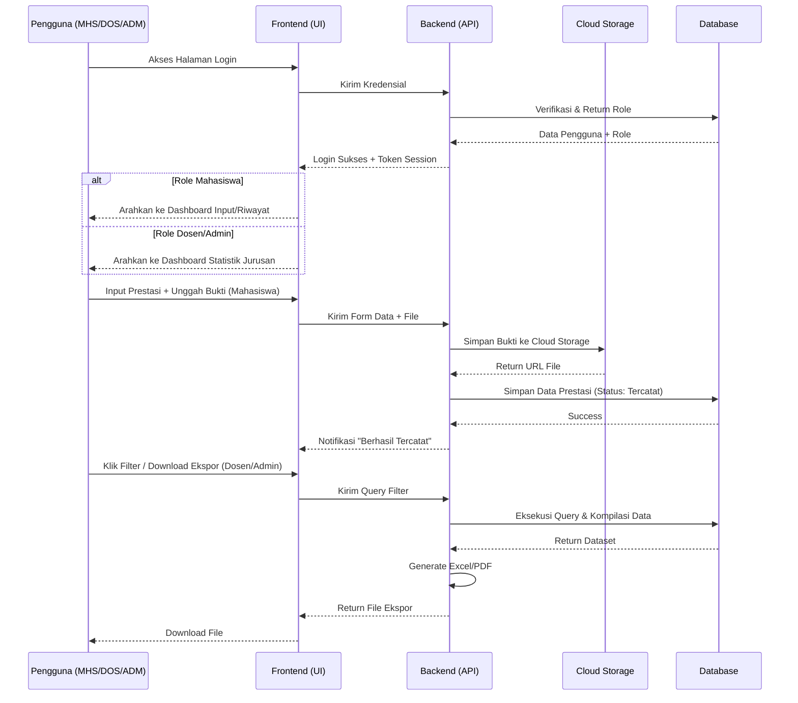
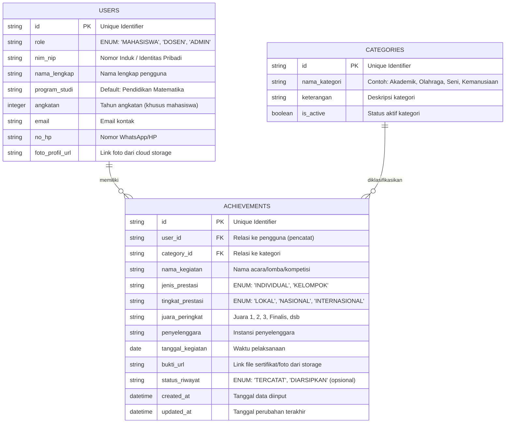

# PRD — Project Requirements Document

## 1. Overview
Sistem Pendataan Prestasi Mahasiswa adalah platform berbasis web yang dimulai langsung dari halaman login dan dirancang khusus untuk mengakomodasi kebutuhan **Jurusan Pendidikan Matematika** dalam mendata, melacak, dan memvisualisasikan pencapaian mahasiswa. Sistem ini memisahkan akses berdasarkan 3 peran utama: **Mahasiswa, Dosen, dan Admin**. Mahasiswa dapat langsung menginput prestasinya yang akan secara otomatis tercatat sebagai data final tanpa melalui proses validasi. Dosen dan Admin memiliki akses ke dashboard yang menampilkan ringkasan statistik prestasi jurusan, serta kemampuan filter dan ekspor data. Aplikasi ini menitikberatkan pada kemudahan input, transparansi data, dan penyediaan laporan instan yang mendukung kebutuhan akreditasi dan monitoring jurusan, dibalut dengan antarmuka visual modern yang konsisten.

## 2. Requirements
- **Manajemen Hak Akses (Role-Based Access):** Sistem wajib mendukung 3 jenis pengguna:
  - *Mahasiswa:* Dapat input prestasi, mengunggah bukti, melihat riwayat prestasi pribadi, dan mengunduh PDF rekap sendiri.
  - *Dosen:* Dapat mengakses dashboard statistik khusus Jurusan Pendidikan Matematika, memfilter data mahasiswa, dan mengekspor laporan monitoring.
  - *Admin Prodi:* Memiliki akses penuh untuk mengelola kategori prestasi, memonitor seluruh data, melakukan ekspor data massal, serta konfigurasi sistem pelaporan.
- **Design System & Estetika Visual:** Implementasikan bahasa desain *Glassmorphism* ala Google yang dominan pada warna **Kuning** dan **Merah**. Antarmuka wajib menampilkan permukaan semi-transparan/translucent, bayangan lembut (*soft shadows*), dan border halus. Komponen dashboard statistik, form input, serta halaman login dibalut dengan aksen warna vibratif (kuning untuk highlight data/aktivitas, merah untuk tombol aksi utama dan notifikasi) guna menciptakan pengalaman visual yang modern, bersih, dan selaras dengan identitas institusi.
- **Ketersediaan & Keamanan Data:** Berkas bukti (sertifikat, foto, surat) yang diunggah mahasiswa harus tersimpan aman di cloud storage, terindeks rapi, dan hanya dapat diakses sesuai tingkat akses peran pengguna.
- **Standarisasi Dokumen Output:** PDF yang dihasilkan harus mematuhi format resmi institusi (kop surat/header jurusan Pendidikan Matematika, identitas mahasiswa, tabel rekapitulasi prestasi tercatat, tanggal cetak, dan kolom tanda tangan pengesahan).
- **Kemudahan Pencarian:** Admin dan Dosen membutuhkan sistem filter multi-kriteria (NIM, nama, angkatan, tahun kegiatan, tingkat/jenis prestasi, kategori) untuk menyaring data dengan cepat.

## 3. Core Features
- **Login & Autentikasi Terpusat:** Halaman utama berupa login. Setelah berhasil, sistem mengarahkan pengguna secara otomatis ke dashboard sesuai peran (Mahasiswa/Dosen/Admin). Better Auth menangani manajemen sesi dan proteksi route berbasis role.
- **Upload & Pencatatan Prestasi (Direct Record):** Form intuitif bagi mahasiswa untuk menginput detail kegiatan dan mengunggah dokumen bukti. Data langsung tersimpan dengan status *Tercatat* secara permanen.
- **Dashboard Statistik Jurusan (Pendidikan Matematika):** Halaman muka untuk Dosen dan Admin yang menampilkan visualisasi data: grafik tren prestasi tahunan, distribusi per kategori/tingkat, performa per angkatan, dan total mahasiswa aktif berkontribusi.
- **Cetak Ringkasan PDF Otomatis:** Sistem *generate PDF* sekali klik untuk mahasiswa dan admin. Dokumen berisi header institusi, identitas, tabel rekap prestasi tercatat, dan area pengesahan.
- **Advanced Filtering & Export Data:** Fitur pencarian berlapis bagi Dosen dan Admin untuk menyaring data spesifik (misal: "Prestasi Nasional Angkatan 2021 Matematika"), lalu mengekspor hasil filter ke Excel/PDF untuk keperluan pelaporan fakultas.
- **Manajemen Kategori Prestasi:** Admin dapat menambah, mengedit, atau menonaktifkan kategori/jenis prestasi agar input mahasiswa selalu selaras dengan standar akreditasi jurusan dan universitas terkini.

## 4. User Flow

**Alur Pengguna: Mahasiswa**
1. **Login:** Masuk menggunakan akun yang telah diregistrasikan oleh sistem/prodi.
2. **Input Prestasi (First Win):** Mahasiswa mengisi form kegiatan (nama lomba, tingkat, juara, tanggal) dan mengunggah bukti sertifikat/foto. Data langsung tersimpan.
3. **Lihat & Downoad:** Mahasiswa dapat membuka halaman riwayat, melihat status prestasi yang telah tercatat, dan menekan tombol *Download PDF Prestasi* untuk keperluan CV atau Lamaran Beasiswa.

**Alur Pengguna: Dosen**
1. **Login:** Masuk menggunakan kredensial dosen.
2. **Tinjau Dashboard Statistik:** Sistem menampilkan laporan visual khusus Jurusan Pendidikan Matematika (total prestasi, tren angkatan, kategori dominan, dll).
3. **Filter & Monitor:** Dosen menerapkan filter (contoh: lihat seluruh prestasi Olahraga tahun 2023) untuk monitoring atau konseling akademik.
4. **Ekspor Laporan:** Mengunduh data hasil filter dalam format Excel/PDF untuk rapat jurusan atau pelaporan tri dharma.

**Alur Pengguna: Admin**
1. **Login:** Masuk menggunakan kredensial admin prodi.
2. **Kelola Sistem & Kategori:** Memastikan daftar kategori prestasi sesuai standar terbaru, menambahkan event/kategori baru jika diperlukan.
3. **Audit & Ekspor Data Penuh:** Mengakses seluruh database prestasi, menerapkan filter lanjutan, dan mengekspor rekapitulasi lengkap untuk kebutuhan akreditasi program studi atau universitas.

## 5. Architecture

Sistem menggunakan arsitektur *Client-Server* modern. Frontend merender dashboard berdinas peran dan form input. Backend API menangani autentikasi, routing berbasis role, manajemen upload ke Cloud Storage, dan penyimpanan transaksi database. Generator PDF berjalan di server untuk menjaga integritas format. Alur validasi telah dihapus, sehingga flow langsung dari input ke penyimpanan permanen.

## 6. Database Schema

Rancangan tabel telah disederhanakan untuk mengakomodasi 3 role dan menghapus alur validasi. Data prestasi langsung tercatat permanen.

## 7. Tech Stack
Dipilih untuk menjamin kecepatan pengembangan, keamanan akses, skalabilitas data, kemudahan deployment, dan implementasi desain yang optimal:

*   **Frontend & Backend (Fullstack Framework):** [Next.js](https://nextjs.org/) (App Router) - Menggabungkan UI dashboard dan API Routes dalam satu kodebase, memudahkan proteksi route berdasarkan role.
*   **Styling & UI Library:** [Tailwind CSS](https://tailwindcss.com/) + [shadcn/ui](https://ui.shadcn.com/) - Dikonfigurasi dengan *design tokens* khusus untuk menerapkan palet Kuning-Merah dominan dan efek *glassmorphism* tingkat lanjut (*backdrop-blur*, transparansi gradasi, *soft shadows*). Komponen tabel interaktif, chart statistik, form input, dan modal mengikuti standar *vibrant UI* ala Google Glassmorphism yang responsif dan modern.
*   **Database ORM:** [Drizzle ORM](https://orm.drizzle.team/) - Query builder type-safe, ringan, mendukung relationship kompleks dan mudah dipelihara.
*   **Database:** [SQLite](https://sqlite.org/index.html) (via LibSQL/Turso) - Efisien biaya, performa tinggi untuk skala program studi, mendukung deployment edge/serverless.
*   **Authentication & RBAC:** [Better Auth](https://better-auth.com/) - Dikonfigurasi dengan middleware proteksi rute yang secara otomatis mengalihkan ke dashboard spesifik (Mahasiswa/Dosen/Admin) dan mengelola sesi aman.
*   **File Storage:** Cloudflare R2 atau Supabase Storage - Menyimpan sertifikat dan foto bukti dengan aman, mendukung presigned URL untuk akses terkontrol.
*   **PDF & Excel Generation:** `@react-pdf/renderer` untuk PDF format akademik, dan `xlsx`/`exceljs` untuk ekspor data Spreadsheet yang rapi.
*   **Deployment:** [Vercel](https://vercel.com/) - Platform standar industri untuk Next.js, mendukung auto-scaling, preview deployment, dan integrasi smooth dengan database serta storage.